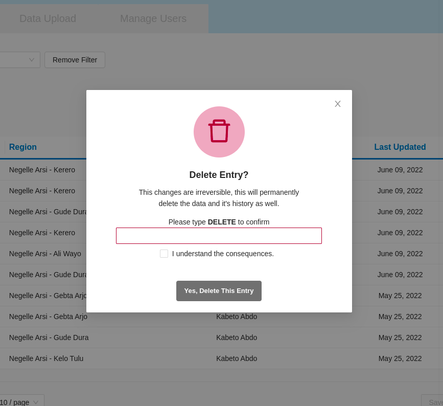

Admin page

Manage data
------------

Filter
~~~~~~

Searching data by
- data point
- City, town or village
- You can also reset your filter search.

.. image:: ../../assets/ethiopia/add-data-entry.png
    :alt: Filtering

Advanced filter
~~~~~~~~~~~~~~~

If you wish to search in a more advanced way, you click on the **ADVANCED FILTER** buttpn.

.. image:: ../../assets/ethiopia/adavanced-filter-data-entry.png
    :alt: Advanced filter

Export filtered data
~~~~~~~~~~~~~~~~~~~~

.. image:: ../../assets/ethiopia/export-filter.png
    :alt: Export filtered data

List of data
~~~~~~~~~~~~

A list of data is on the page as a table which has
- data name
- Region
- Submitter
- Last updated
-  Action

.. image:: ../../assets/ethiopia/list-data-entry.png
    :alt: List of data

Edit
~~~~

A data entry can be edited.

.. image:: ../../assets/ethiopia/edit-data-entry.png
    :alt: Edit

Delete
~~~~~~

A data entry can be deleted.

Add
~~~

You also can add a new data entry.

.. image:: ../../assets/ethiopia/add-data-entry.png
    :alt: Add