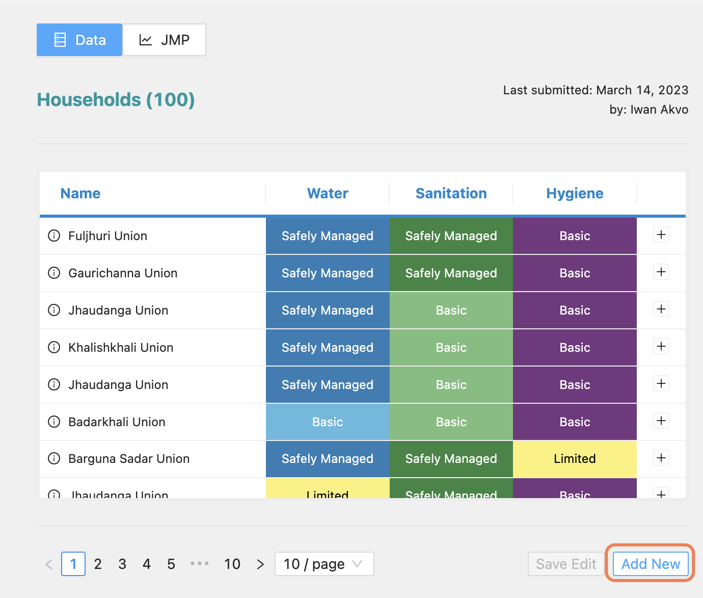
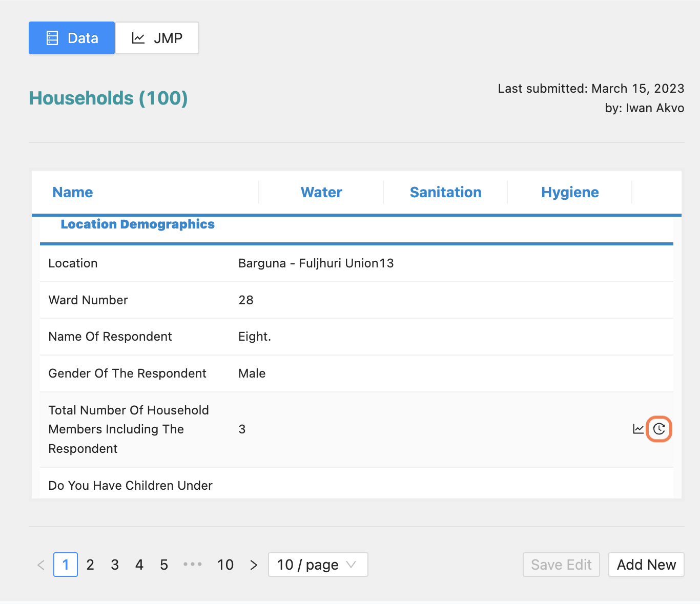

Overview
---------
- Each data has multiplr questions and question groups.

.. image:: ../../assets/bangladesh/example-overview.png
    :alt: Datasets overview

Search
-------

Selecting
~~~~~~~~~

- Filtering a data point by selecting name, village, town or city
- You reset your search by clicking the **REMOVE FILTE** button.

.. image:: ../../assets/bangladesh/filter.png
    :alt: Filtering

Advanced search
~~~~~~~~~~~~~~~~
If you wish to search in more advanced way, an **Advanced filter** button is clickable that shows an input select.

.. image:: ../../assets/bangladesh/advanced-filter.png
    :alt: Advanced filter

Manage data
-----------

Add data
~~~~~~~~

You can add new data by pressing the **Add new** button.

Fill in all the form fields in each section and then press the **Submit** button to save them.

.. image:: ../../assets/bangladesh/add-data-entry-2.png
    :alt: Add data entry

Edit data
~~~~~~~~~

Open one of the data by clicking the **plus** button

.. image:: ../../assets/bangladesh/edit-data-1.png
    :alt: Expand data

Click on the data that you want to edit

.. image:: ../../assets/bangladesh/edit-data-2.png
    :alt: Expand data

Click the **Save** button to save the changes

.. image:: ../../assets/bangladesh/edit-data-3.png
    :alt: Expand data

The saved data is still in draft status, which means the changes can be undone by clicking the undo button

.. image:: ../../assets/bangladesh/edit-data-4.png
    :alt: Expand data

Click the **Save Edit** button to permanently apply the changes.

.. image:: ../../assets/bangladesh/edit-data-5.png
    :alt: Expand data

Data history
~~~~~~~~~~~~

All changes made to each data will be saved in the history, which can be viewed by clicking the **Clock** button.

The history table will appear with data sorted in descending order (the latest data will be displayed at the top).

.. image:: ../../assets/bangladesh/data-history-2.png
    :alt: History table shown

Map
---

- A map is on the page which shows all places, village, town or city from where the data is collected.
- This map can be zoomed out or in

.. image:: ../../assets/bangladesh/map.png
    :alt: Map

Legend
-------

A legend that displays the level of data services is shown on the page under the map.

.. image:: ../../assets/bangladesh/legend.png
    :alt: Legend

Chart data
-----------

JMP
~~~

A chart is also on the page once the **JMP tab** is active

.. image:: ../../assets/bangladesh/jmp-chart.png
    :alt: JMP chart

Bar
~~~

- A disruption of a question is shown on a **Bar char**. To see this, you have to select a question.
- This bar chart can also be saved as an image by clickin on the **SAVE IMAGE** icon.
- If you would love to see the question value on a table, there is table icon that can be clicked to do so.

.. image:: ../../assets/bangladesh/bar-chart.png
    :alt: Bar chart

