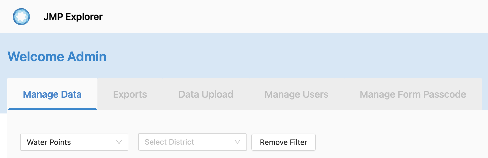
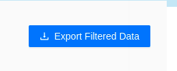
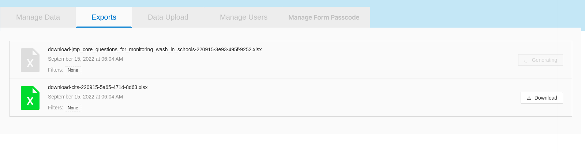
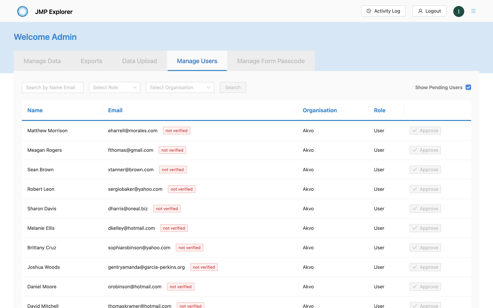
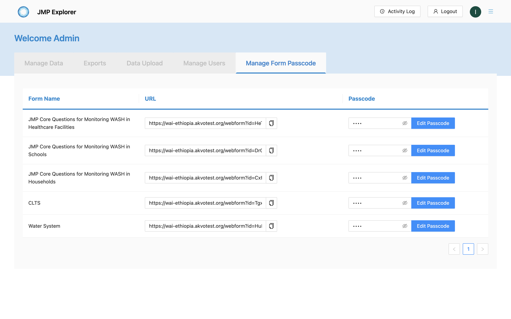
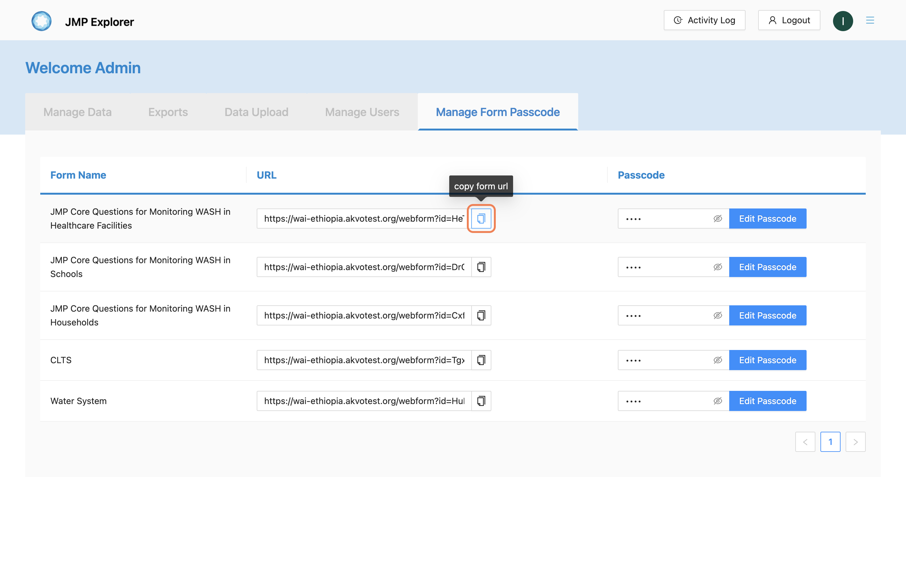
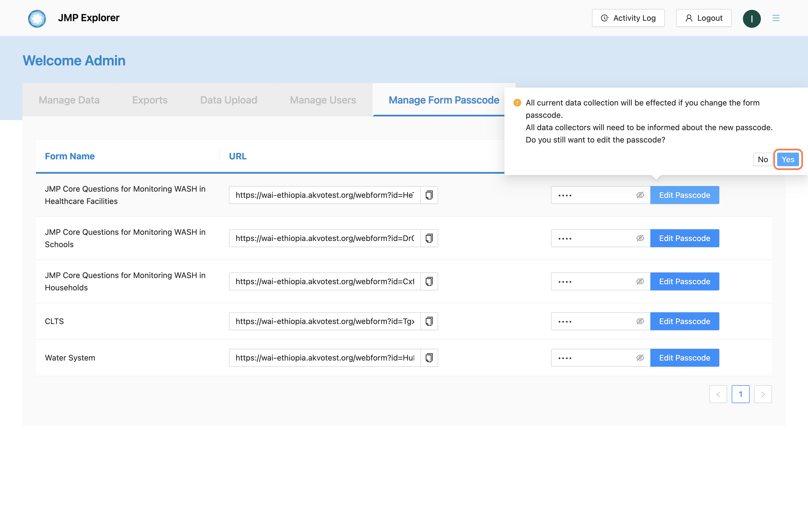
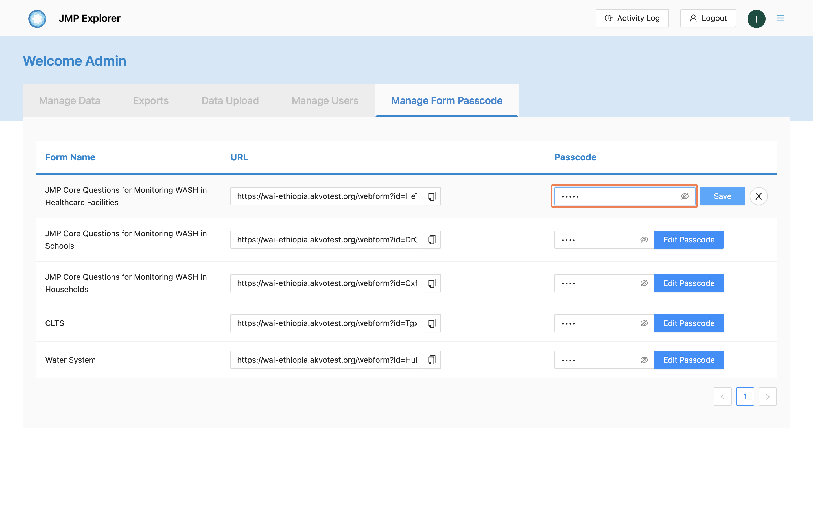
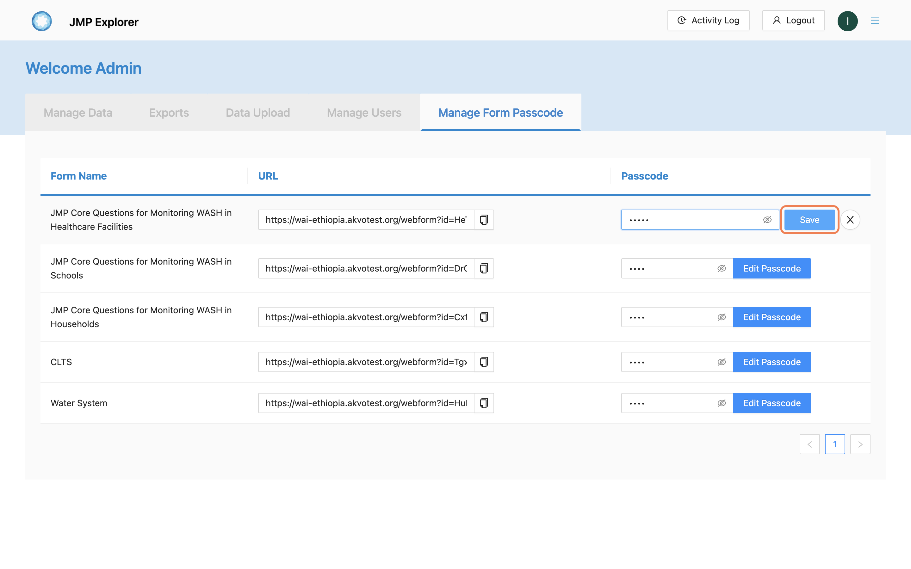

##########
Admin page
##########

===========
Manage data
===========

******
Filter
******

Searching data by
- data point
- District, sub-district and village
- You can also reset your filter search.

***************
Advanced filter
***************

If you wish to search in a more advanced way, you click on the **ADVANCED FILTER** button.

.. image:: ../assets/user-guide/adavanced-filter-data-entry.png
    :alt: Advanced filter

********************
Export filtered data
********************

************
List of data
************

A list of data is on the page as a table which has
- data name
- Region
- Submitter
- Last updated
-  Action

.. image:: ../assets/user-guide/list-data-entry.png
    :alt: List of data

************
Editing data
************

A data entry can be edited.

.. image:: ../assets/user-guide/edit-data-entry.png
    :alt: Edit

***********
Delete Data
***********

A data entry can be deleted.

.. image:: ../assets/user-guide/delete-data-entry.png
    :alt: Delete

************
Add New Data
************

You also can add a new data entry.

.. image:: ../assets/user-guide/add-data-entry.png
    :alt: Add

===========
Export Data
===========

You can see a list of exported data entries that you can download.

===========
Upload Data
===========

You can also upload a new data entry from your **file manager** or download existing data by clicking on the **Download** button.

.. image:: ../assets/user-guide/data-entry-upload.png
    :alt: data upload

============
Manage users
============

A list of users is displayed on the page with their:
- Name
- Email
- Organisation
- Role

====================
Manage form passcode
====================

A list of form that accessable via URL and is displayed on the page with the following columns: 
- Form name
- URL
- Passcode (The text field is encrypted by default)

********
Copy URL
********

The URL field has a copy functionality to get URL easily

*************
Edit Passcode
*************

You can edit text field by clicking the **Edit passcode** button

.. image:: ../assets/user-guide/admin-manage-passcode-edit-1.png    
    :alt: Edit passcode clicked

Once edit is clicked, a warning pop-up will appear to confirm the user

If you select yes, then the text field can be filled in with the new passcode. Otherwise, the text field will return readonly.

Click the save button to save the passcode you just created

